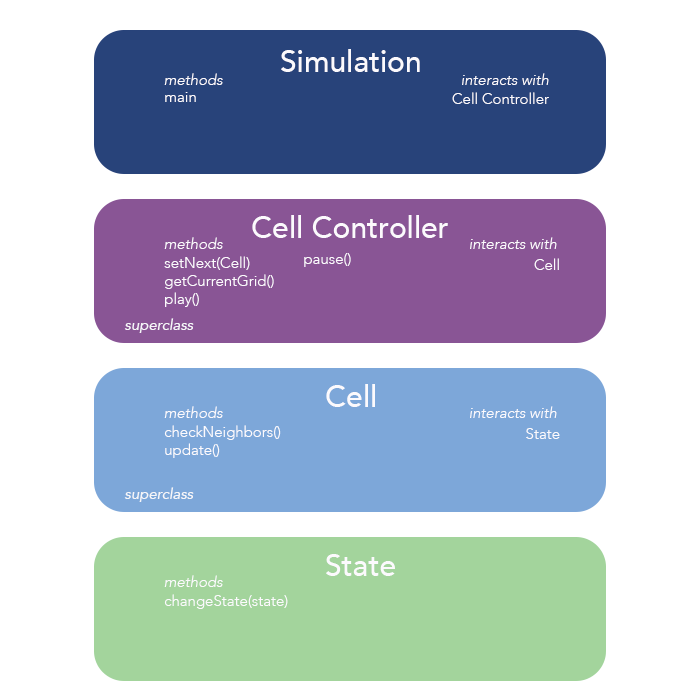

# Design Plan

Cell Society [assignment](https://www2.cs.duke.edu/courses/compsci308/current/assign/02_cellsociety/index.php)

Completed by Julia Long, Jeffrey Li, and Edward Zhuang

### Introduction

The goal is to create a 2D simulation of cells arranged in a grid. These cells have a finite number of states that change  in reaction to their adjacent cells. Sets of rules dictating responses can be imposed onto these cells and they react accordingly with time. The simulation can have different rules of controlling cell reaction and different grid sizes as dictated by the user. How cells react and the type of cells is open for extension; how our super-classes act will be closed.

### Overview 

In our program, we plan to make several classes, including a Simulation, Cell Controller, Cell, and State class. The Simulation class will be responsible for the overall user interface and structure, and it will have methods that set up specific simulations. We will have a Cell Controller superclass for each set of rules. The Cell Controller class will extract information from the cells, apply rules, and inform the cells of what state to change to next. We will have Cell Controller subclasses for each set of rules. The Cell Controller will be responsible for all the cells in the simulation; it will let cells know what their next state should be and when they should update their states. The cell class will contain information about its current state, next state and its adjacent cells. It will pass this information to the Cell Controller, and receive information from the Cell Controller about when to change to the next state. The state class will hold a color value, which will represent various states (on, off, etc.). The color will likely be represented by an imageView.
The design of our program is as follows. The methods given are the ones that are public and will allow the classes to interact with one another.

### User Interface

The user interface will feature a main display where the user can see the starting grid. On this screen, the user can choose which simulation they would like to run, potentially by a drop down menu. The user will also be able to choose the grid size of the simulation. There will be a “play” button that will start the simulation, a “pause” button that will allow the user to pause the simulation, a “skip” button that will move the simulation forward a specified amount of time, and a “stop” button that will stop the simulation and reset to the beginning. In addition, there will be labels that present statistics about the current simulation (ex. How many cells are on). When the simulation is finished, the programme will restart and the user can choose another simulation.

### Design Details

Our design contains the classes: Simulator, CellController (Super class), Cell (Super Class) and State.

The Simulator class deals with the user interface and user interaction. It will contain the user interaction flow, read in the appropriate files, guide the user to choose a simulation type,  and call the appropriate methods that set up the other classes. We needed this class in order to keep the user interface distinct from the back end programming.

The Cell Controller super class will include the rules of the simulation and keep track of the cells in the simulation in an array. The class will loop over the cells, asking the cells to send information regarding their neighbours, and then use the rules to work out the correct next state. The next states will be stored within the cells themselves. When all the next states are determined, the Cell Controller class will loop over the cells again and tell them to change to the next state. Subclasses will contain different rules for different simulations. If a new type of simulation needs to be added, a new subclass can be added.

The Cell super class is simply the cells themselves. They will have instance variables (top, bottom, left, right) which keep track of the neighbours. The cells pass information to the Cell Controller regarding their current state and the current state of their neighbours. Then the cells receive information back from the Cell Controller about what state to change to next, and then apply this change. The subclasses we have thought of so far are EdgeCell, CornerCell and MiddleCell which mainly differ in the number of neighbours. If the user wants to change the shapes of the cells, they can add new Cell subclasses.

The State class is an instance variable of the Cell class. It will contain an ImageView and String in order to determine the current state. It is changed by the Cell Controller through the Cell.

Use Cases:
1. The Simulation class would call an updateGrid method in the appropriate Cell Controller subclass. The Cell Controller would then loop through all cells in the simulation, calling the  checkNeighbors method in the Cell class to get the necessary information about the surrounding cells. The Cell Controller would track the changes to be made, and then call an update method within the Cell class for each cell. The Cell would then call an update method in the State class, which would change the state of the cell.
2. The process would be very similar to what was described above, but the cell called would be a different subclass of the Cell class because it is an edge cell. This will change the implementation of the checkNeighbors method within that Cell class, because the cell will not be completely surrounded by neighbors.
3. The CellController will have collected the information about the neighbors of each cell in the simulation and used this information, along with the rules for the specific subclass, to decide on the next state for each cell, and stored this information within the Cell as the property nextState. The CellController will then loop through all cells, calling the update method within the Cell class. This will change the current state of each cell to its stored next state.
4. The simulator will process the information given within a relevant XML file. From a file, the simulator should be able to interpret what type of simulation is required, and what the specific parameters are. With this information, the simulator will create the appropriate CellController subclass and pass in the designated parameters it parses from the file. 
5. To switch simulations, the GUI will have a drop down menu near the top of the scene which will allow users to select between all available types of simulations. By selecting a specific simulation type, the simulator will create a cell controller with rules specific to that simulation, along with the necessary cells, as detailed within the XML file. 

### Design Considerations

We discussed at length where we wanted to implement the checkNeighbors() method, which would check the states of the cells around a given cell and determine if the state needs to change. We felt that it could fit either in the CellController class or the Cell class. Including it as a method in the CellController class would help us to better keep track of the current and future states of the cells in the simulation, and including it in the Cell class would allow us to isolate the properties of the cell in their class, reducing the need for getters and setters. We decided to implement the method within the Cell class, and return the result from the Cell class to the CellController class so that the Cell Controller could implement the specific rules and tell the Cell how to change.
We also discussed how to keep track of different rules and different cell types, and we ultimately decided to make the Cell class and the CellController class superclasses. This allows us to create subclasses specific to different types of cells and different rules. For example, we can implement several different shapes by creating different shaped Cell subclasses, and we can implement different sets of rules through different Cell Controllers. This also makes the simulator easier to build upon in the future -- if someone wants to create another kind of simulation with different rules, they can simply create a new CellController with the desired properties. 
We initially thought that we would store the next states for the grid of cells within an array of arrays in the Cell Controller, but as we started to write our Design Plan, we realized that it would be much cleaner to store the nextState within the Cell itself, and to simply call an update function within each Cell that would change currentState to nextState.

### Team Responsibilities
To split up the coding responsibilities of each team member, we decided that each person would be responsible for creating a specific set of classes, which will all ultimately be combined in one project. For primary responsibilities, Edward Zhuang will be responsible for creating the Simulation class, Julia Long will be responsible for creating the Cell Controller class and subclasses, and Jeffrey Li will be responsible for creating the Cell and State classes and subclasses.
At the same time, we understand that these workloads may not be even initially; thus, our secondary responsibilities are to assist each other with code if there is an imbalance of responsibilities. We will continuously provide each other with progress updates and reevaluate team responsibilities if necessary.   

